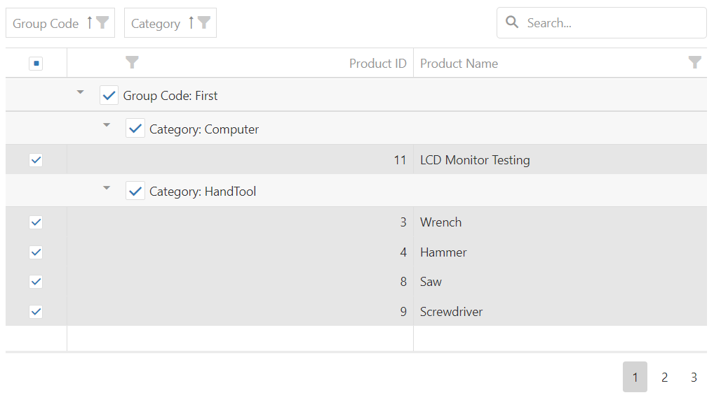

<!-- default badges list -->

<!-- default badges end -->

# DataGrid for DevExtreme - How to implement a three-state "Select All" CheckBox in a group row 

This example demonstrates how to implement a custom "Select All" CheckBox in a group row to select all rows in this group. This CheckBox can have three states: unchecked, checked, or undetermined (when only several of the group members are checked).

This example supports the [DataGrid.remoteOperations](https://js.devexpress.com/Documentation/ApiReference/UI_Components/dxDataGrid/Configuration/remoteOperations/) option.

DataGrid may query all data when selecting a group row with many data records. You can use the **DataGrid.selection.maxFilterLengthInRequest** private option to increase this threshold but it may result in Error 400. Make sure that your server supports long URLs. Also, make sure to test **maxFilterLengthInRequest** after every DevExtreme upgrade since we may change this private API without notifications.

## Files to Review

- **jQuery**
    - [index.js](jQuery/src/index.js)
    - [GroupSelectionBehavior.js](jQuery/src/GroupSelectionBehavior.js)
- **ASP.NET Core**
    - [Index.cshtml](ASP.NET%20Core/Views/Home/Index.cshtml)
    - [GroupSelectionBehavior.js](ASP.NET%20Core/wwwroot/js/GroupSelectionBehavior.js)    
- **Angular**
    - [GroupRowSelectionHelper.ts](Angular/src/app/GroupRowSelection/GroupRowSelectionHelper.ts)
    - [group-row.component.html](Angular/src/app/GroupRowSelection/group-row-component/group-row.component.html)
    - [group-row.component.ts](Angular/src/app/GroupRowSelection/group-row-component/group-row.component.ts)
- **React**
    - [App.tsx](React/src/App.tsx)
    - [GroupRowComponent.tsx](React/src/GroupRowSelection//GroupRowComponent.tsx) 
    - [hooks.ts](React/src/GroupRowSelection/selection-context/hooks.ts)
- **Vue**
    - [Home.vue](Vue/src/components/HomeContent.vue)
    - [GroupRowComponent.vue](Vue/src/components/GroupRowSelection/GroupRowComponent.vue)
    - [GroupRowSelectionHelper.ts](Vue/src/components/GroupRowSelection/GroupRowSelectionHelper.ts)
      
## Implementation details

The GroupSelectionBehavior class uses the [customizeColumns](https://js.devexpress.com/Documentation/ApiReference/UI_Components/dxDataGrid/Configuration/#customizeColumns) function to specify [groupCellTemplate](https://js.devexpress.com/Documentation/ApiReference/UI_Components/dxDataGrid/Configuration/columns/#groupCellTemplate) for all columns. This template creates a CheckBox for every group row.

## Documentation

- [CheckBox - API Reference](https://js.devexpress.com/Documentation/ApiReference/UI_Components/dxCheckBox/)
- [DataGrid - API Reference](https://js.devexpress.com/Documentation/ApiReference/UI_Components/dxDataGrid/)

## More Examples

- [DataGrid Multiple Record Selection API Demo](https://js.devexpress.com/Demos/WidgetsGallery/Demo/DataGrid/MultipleRecordSelectionAPI)
<!-- feedback -->
## Does This Example Address Your Development Requirements/Objectives?

 

(you will be redirected to DevExpress.com to submit your response)
<!-- feedback end -->
