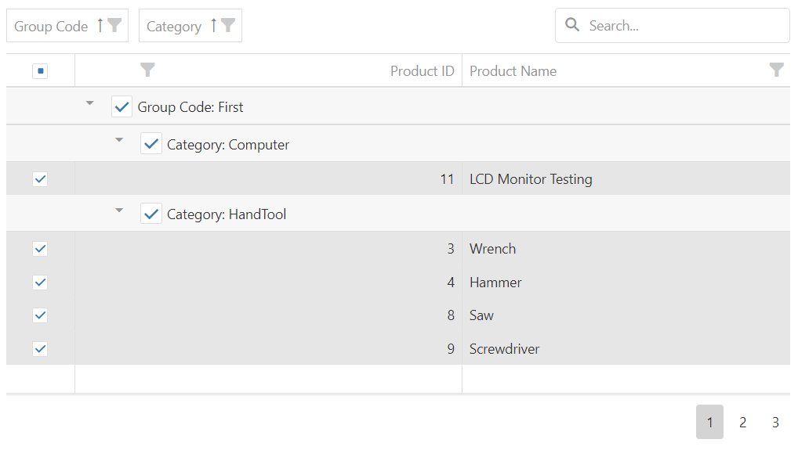

<!-- default badges list -->

<!-- default badges end -->

# DataGrid for DevExtreme - How to implement a three-state "Select All" CheckBox in a group row 

This example demonstrates how to implement a custom "Select All" CheckBox in a group row to select all rows in this group. This CheckBox can have three states: unchecked, checked, or undetermined (when only several of the group members are checked).

This example supports the [DataGrid.remoteOperations](https://js.devexpress.com/Documentation/ApiReference/UI_Components/dxDataGrid/Configuration/remoteOperations/) option.

DataGrid may query all data when selecting a group row with many data records. You can use the **DataGrid.selection.maxFilterLengthInRequest** private option to increase this threshold but it may result in Error 400. Make sure that your server supports long URLs. Also, make sure to test **maxFilterLengthInRequest** after every DevExtreme upgrade since we may change this private API without notifications.

## Files to Review

- **jQuery**
    - [index.js](jQuery/index.js)
    - [GroupSelectionBehavior.js](jQuery/GroupSelectionBehavior.js)

## Implementation details

The GroupSelectionBehavior class uses the [customizeColumns](https://js.devexpress.com/Documentation/ApiReference/UI_Components/dxDataGrid/Configuration/#customizeColumns) function to specify [groupCellTemplate](https://js.devexpress.com/Documentation/ApiReference/UI_Components/dxDataGrid/Configuration/columns/#groupCellTemplate) for all columns. This template creates a CheckBox for every group row.

## Documentation

- [CheckBox - API Reference](https://js.devexpress.com/Documentation/ApiReference/UI_Components/dxCheckBox/)
- [DataGrid - API Reference](https://js.devexpress.com/Documentation/ApiReference/UI_Components/dxDataGrid/)

## More Examples

- [DataGrid Multiple Record Selection API Demo](https://js.devexpress.com/Demos/WidgetsGallery/Demo/DataGrid/MultipleRecordSelectionAPI)
